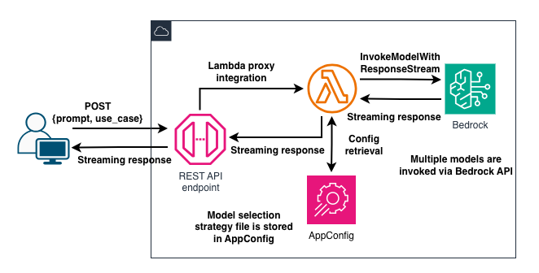

# AIP-C01 Task 1.2 - Model selection app

The project implements a part of the Skill Builder exam preparation learning path bonus assignment for Task 1.2.

The code and architecture pattern are based on AWS training materials.

[Domain 1 Review: AWS Certified Generative AI Developer - Professional (AIP-C01- English)](https://skillbuilder.aws/learn/GT2P1KK636/domain-1-review-aws-certified-generative-ai-developer--professional-aipc01-english/4GWFTZBZ74?parentId=4SCMN2659K)

## Pre-requisites

* Node.js v24 and `npm` installed.
* Python and `uv` installed.
* Valid AWS credentials configured locally

## Before you deploy it

I deployed the stack to `eu-central-1` and used inference profile IDs throughout. If you use a different geography, double-check the model IDs/inference profile IDs and the pricing info.

## Architecture

## Running the model evalutions

Configure the following in `scripts/manual_model_evaluation.py` before running the script:

* Choose some models supported by Bedrock to evaluate and add their IDs in the `models` list.
* Update the pricing info for each model in the `MODEL_PRICING` dictionary.
* Optionally, update the test cases.
* Feel free to modify the `temperature` and `topP` inference parameters in `invoke_model` and the weights in `create_model_selection_strategy`.

You can run the model evaluation script locally.

* `cd scripts`
* `uv init`
* `uv venv`
* `source .venv/bin/activate`
* `uv add -r requirements.txt`
* `uv run manual_model_evaluation.py`

The script will create the configuration file in the `config` folder.

## Infrastructure deployment

The resources can be deployed as follows:

* `cd` to the project root.
* `npm install`
* `npx cdk deploy`

## Run the app

* Navigate to the `frontend` folder: `cd frontend`.
* Create a file called `.env` in the folder. Copy the REST API invoke URL from the console. Add it to the `VITE_MODEL_SELECTION_API_URL` environment variable. See `.env.example` for reference.
* Run `npm install`
* Run `npm run dev`

The server starts running on `http://localhost:5173`.

Enter a prompt and select the use case. The response should gradually appear on the screen as the chunks arrive.

## Limitations

The app is **NOT** production ready and is not intented to be so. It's missing many key elements necessary for production environments.
